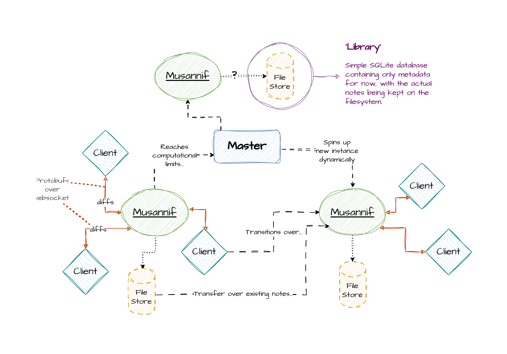

# Musannif

Server for Musannif, A sophisticated collaborative Markdown editor designed for teams, enabling seamless real-time collaboration and creativity.

## Architecture

### High-Level Diagram



### Core Ideas

- Clients communicate diffs back and forth through a central server that resolves conflicts should any arise
- If a central server is reaching computational limits, it informs a master server to spin up a new server to handle the load, and transmits data to it, as well as transferring clients to it
- CHECK: Move database to a separate server that communicates with the master and/or worker servers

## Usage

```bash
./musannif --signup -username <username> -password <password> # Optional
./musannif -serve
```

## Installing

- 

### Locally

```bash
git clone https://github.com/musannif-md/musannif.git
cd musannif
cp config_example.yaml config.yaml # and modify the new file accordingly
make
```

## TODO

- [x] Init a basic logger - create wrapper over zerolog
- [x] Mete out system architecture - how to approach horizontal scaling?
- [x] CI/CD: Publish new 'release' whenever a tagged commit is pushed
- [ ] v1.0
  - [x] File/'Note' management on disk
  - [ ] simple web-client for single user to create/edit their notes
  - [ ] Single user note modification
- [ ] v2.0
  - [ ] Real-time collaboration w/ multiple users
  - [ ] Note sharing via URL - let guests view notes
- [ ] v3.0 User directory/Team management
- [ ] Shift to Protobufs
- [ ] 'Recently Deleted' note section
- [ ] ???
